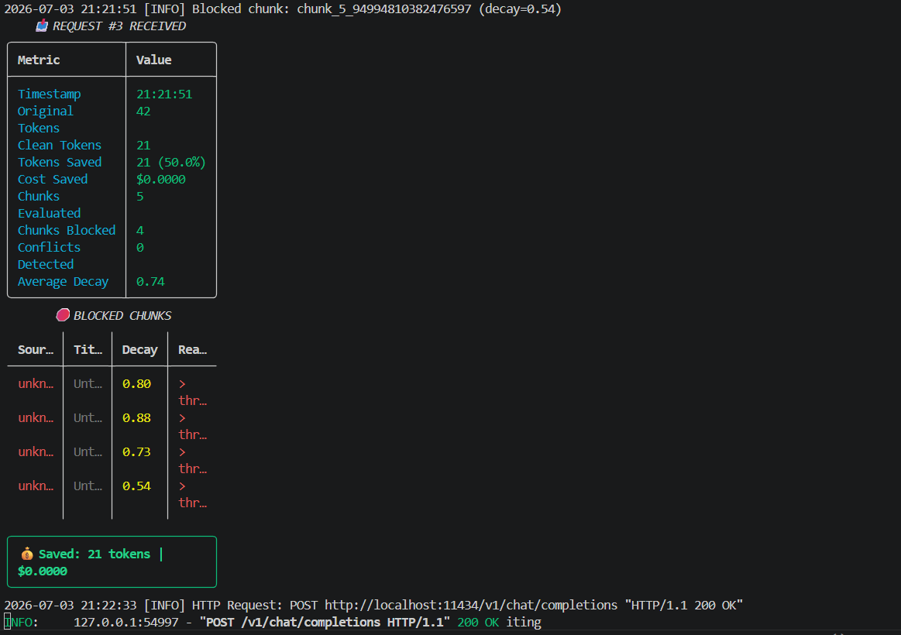

# KU-Gateway



**The Context Firewall for LLMs.**

KU-Gateway is a drop-in, OpenAI-compatible proxy that sits between your application and your LLM provider. It intercepts outgoing chat requests, evaluates any embedded reference material for staleness using the [Knowledge Universe](https://api.knowledgeuniverse.tech) freshness API, strips out context that has decayed past a configurable threshold, and forwards a cleaned request upstream — before you pay to send it, and before your model reasons over it.

```
Your App  ──▶  KU-Gateway (:8000)  ──▶  LLM Provider (OpenAI / Anthropic / Gemini / local)
                    │
                    ├─▶ extract <context> blocks from the request
                    ├─▶ score each block via the KU API (decay_score, velocity, conflicts)
                    ├─▶ drop anything past the decay threshold
                    └─▶ forward the trimmed request + print live telemetry
```

## Why

Retrieval pipelines happily hand a model documents that are months or years stale — deprecated APIs, superseded research, contradicted claims — with no signal that anything has changed. That costs tokens, and it costs correctness. KU-Gateway adds a scoring and gating layer in front of the model call so stale material never makes it into context in the first place.

## Features

- **OpenAI-compatible proxy** — point any OpenAI SDK client at `http://localhost:8000/v1` and it works unmodified.
- **Context extraction** — automatically finds `<context>...</context>` blocks inside message content.
- **Freshness scoring** — each block is scored against the KU API for `decay_score` (0 = fresh, 1 = decayed), `knowledge_velocity` (`frozen` / `slow` / `moderate` / `fast` / `hypersonic`), and `conflict_detected`.
- **Configurable gating** — a global decay threshold, plus optional per-source overrides (e.g. treat `arxiv` and `stackoverflow` differently).
- **Live terminal telemetry** — a Rich-rendered per-request dashboard (tokens saved, chunks blocked, average decay, cost saved) plus a session summary on shutdown.
- **`/v1/telemetry` endpoint** — pull the same stats programmatically for a dashboard or logging pipeline.
- **Optional Redis caching** — avoid re-scoring the same chunk on every request.
- **Fail-open on unexpected errors** — if scoring throws an uncaught exception, the chunk is kept rather than silently dropped; a reachable-but-erroring KU API instead returns a neutral `decay_score=0.5, confidence=0.0` result, which is then gated normally against your threshold.
- **Docker + Kubernetes manifests included** — image, compose stack with mock KU/LLM services for local testing, and Deployment/Service/Ingress/ConfigMap/Secret manifests for a real cluster.

## Requirements

- Python 3.9+
- A Knowledge Universe API key (`KU_API_KEY`, must start with `ku_`) — get one at [api.knowledgeuniverse.tech](https://api.knowledgeuniverse.tech)
- An upstream LLM provider reachable over an OpenAI-compatible `/v1/chat/completions` endpoint
- Redis, only if you enable response caching

## Installation

```bash
git clone https://github.com/VLSiddarth/KU-Gateway.git
cd KU-Gateway
make install          # pip install -e ".[dev]"
```

## Quick Start

```bash
cp .env.example .env
# edit .env and set KU_API_KEY, and UPSTREAM_LLM_BASE_URL if you're not targeting OpenAI directly

make run              # uvicorn ku_gateway.main:app --host 0.0.0.0 --port 8000 --reload
```

Point your existing OpenAI client at the gateway instead of the provider directly:

```python
from openai import OpenAI

client = OpenAI(base_url="http://localhost:8000/v1", api_key="sk-your-llm-key")

response = client.chat.completions.create(
    model="gpt-4",
    messages=[
        {"role": "system", "content": "You are helpful."},
        {"role": "user", "content": "Tell me about the latest AI trends. <context>arxiv paper from 2022</context>"},
    ],
)
print(response.choices[0].message.content)
```

```javascript
const { Configuration, OpenAIApi } = require("openai");

const configuration = new Configuration({
  basePath: "http://localhost:8000/v1",
  apiKey: "sk-your-llm-key",
});
const openai = new OpenAIApi(configuration);

const completion = await openai.createChatCompletion({
  model: "gpt-4",
  messages: [
    { role: "system", content: "You are helpful." },
    { role: "user", content: "Latest news <context>old article</context>" },
  ],
});
console.log(completion.data.choices[0].message.content);
```

```bash
curl -X POST http://localhost:8000/v1/chat/completions \
  -H "Content-Type: application/json" \
  -H "Authorization: Bearer sk-your-llm-key" \
  -d '{
    "model": "gpt-4",
    "messages": [
      {"role": "user", "content": "Hello <context>old info</context>"}
    ]
  }'
```

Any `<context>...</context>` block in a message gets pulled out, scored, and either passed through or stripped before the request continues on to your LLM provider.

## Configuration

All settings are environment variables (loaded from `.env` via `pydantic-settings`).

| Variable | Default | Description |
|---|---|---|
| `KU_GATEWAY_HOST` | `0.0.0.0` | Bind address |
| `KU_GATEWAY_PORT` | `8000` | Bind port |
| `KU_GATEWAY_DEBUG` | `false` | Enables uvicorn auto-reload |
| `KU_GATEWAY_WORKERS` | `4` | Uvicorn worker count |
| `KU_API_KEY` | *(required)* | Knowledge Universe API key; must start with `ku_` |
| `KU_API_URL` | `https://api.knowledgeuniverse.tech` | KU scoring API base URL |
| `KU_API_TIMEOUT` | `30` | Timeout (seconds) for KU API calls |
| `KU_DECAY_THRESHOLD` | `0.5` | Global decay cutoff — chunks scoring **at or above** this are blocked |
| `KU_SOURCE_THRESHOLDS` | `{}` | JSON object of per-source threshold overrides, e.g. `{"arxiv": 0.7, "github": 0.3}` |
| `KU_RATE_LIMIT` | `100` | Requests/minute (middleware scaffold — see Known Limitations) |
| `KU_REDIS_ENABLED` | `false` | Enable Redis caching of decay scores |
| `KU_REDIS_URL` | *(none)* | Redis connection URL |
| `KU_REDIS_TTL` | `3600` | Cache TTL in seconds |
| `KU_VAULT_ENABLED` | `false` | Enable BYOK vault (not yet implemented — see Known Limitations) |
| `KU_VAULT_API_URL` | *(none)* | Vault service URL |
| `KU_TELEMETRY_ENABLED` | `true` | Enable terminal telemetry output |
| `KU_TELEMETRY_COLORS` | `true` | Colorized Rich output |
| `KU_TELEMETRY_TABLES` | `true` | Render tables (vs. plain text) |
| `KU_LOG_LEVEL` | `info` | Log level |
| `KU_ALLOWED_ORIGINS` | `["*"]` | CORS allowed origins |
| `KU_ALLOWED_HOSTS` | `["*"]` | Trusted host list |
| `KU_OPENAI_ENDPOINTS` | `openai.com`, `api.openai.com`, `api.anthropic.com`, `api.gemini.google.com` | Recognized OpenAI-compatible upstream hosts |

Two more are read directly from the environment (not part of the `Settings` model):

| Variable | Default | Description |
|---|---|---|
| `UPSTREAM_LLM_BASE_URL` | `https://api.openai.com` | Where cleaned requests are forwarded |
| `OPENAI_API_KEY` | *(none)* | Fallback `Authorization` header if the incoming client request doesn't supply one |

## API Reference

| Endpoint | Method | Description |
|---|---|---|
| `/` | `GET` | Service name, version, status |
| `/health` | `GET` | Health check (gateway + cache status) |
| `/v1/chat/completions` | `POST` | Main proxy endpoint — OpenAI-compatible, supports streaming |
| `/v1/telemetry` | `GET` | Session stats: total requests, tokens saved, cost saved, conflicts, recent request log |

## How Scoring Works

Each extracted context chunk is sent to the KU API's `/v1/discover` endpoint and comes back with:

- `decay_score` (0.0–1.0) — 0 is fresh, 1 is fully decayed
- `knowledge_velocity` — how fast this topic area moves: `frozen`, `slow`, `moderate`, `fast`, `hypersonic`
- `conflict_detected` — whether the chunk contradicts more current knowledge
- `confidence` — KU's coverage confidence in the score itself

A chunk is kept only if its `decay_score` is below the applicable threshold (global `KU_DECAY_THRESHOLD`, or a per-source override from `KU_SOURCE_THRESHOLDS`). Everything else is blocked and reported in the telemetry output, along with the reconstructed token savings.

## Telemetry

With `KU_TELEMETRY_ENABLED=true`, every request prints a live summary to the terminal: original vs. clean token counts, tokens/cost saved, chunks evaluated vs. blocked, average decay of blocked chunks, and a breakdown table of what got blocked and why. A session summary (total requests, total savings, uptime) prints on shutdown. The same data is available over HTTP at `GET /v1/telemetry`.

## Docker

```bash
make docker-build          # docker build -t ku-gateway:latest .
make docker-up             # docker-compose up --build
```

`docker-compose.yml` spins up the gateway alongside a mock KU API and a mock LLM echo server, so you can exercise the full request/response loop without live credentials.

## Kubernetes

Manifests for a real cluster deployment are in `kubernetes/`:

- `deployment.yaml` — gateway Deployment
- `service.yaml` — ClusterIP Service
- `ingress.yaml` — Ingress rules
- `configmap.yaml` — non-secret config (e.g. `decay_threshold`)
- `secrets.yaml` — `KU_API_KEY` and friends

```bash
kubectl apply -f kubernetes/
```

## Testing

```bash
make test          # pytest -v
make lint          # ruff check src/ tests/
```

Unit tests cover the evaluator, stripper, telemetry, and proxy modules; integration tests (`tests/integration/`) exercise the mock KU API end-to-end.

## Project Structure

```
KU-Gateway/
├── src/ku_gateway/
│   ├── main.py          # FastAPI app, middleware wiring, /  and /health
│   ├── proxy.py         # /v1/chat/completions handler, upstream forwarding
│   ├── evaluator.py      # calls the KU API per chunk, handles caching + failures
│   ├── stripper.py       # decay-based filtering, message reconstruction, stats
│   ├── models.py          # ContextChunk, DecayResult, Gateway request/response models
│   ├── config.py          # pydantic-settings environment configuration
│   ├── cache.py            # optional Redis cache for decay scores
│   ├── telemetry.py        # Rich terminal dashboard + logging setup
│   ├── middleware.py        # rate-limit / auth middleware (scaffold)
│   └── vault.py              # BYOK vault client (scaffold)
├── tests/                # unit + integration tests
├── examples/              # curl, Python, and Node.js usage samples
├── kubernetes/             # Deployment/Service/Ingress/ConfigMap/Secret manifests
├── docker-compose.yml       # gateway + mock KU API + mock LLM for local testing
├── Dockerfile
└── Makefile                  # install / run / test / lint / docker-build / docker-up
```

## Known Limitations

This is a `1.0.0` beta — a few things are intentionally scaffolded rather than fully built out:

- `RateLimitMiddleware` and `AuthMiddleware` are currently pass-through stubs; `KU_RATE_LIMIT` is not yet enforced.
- The BYOK `Vault` client is a stub (`enabled = False` always); `KU_VAULT_*` settings have no effect yet.
- Message reconstruction in `stripper.reconstruct_messages` is a simplified reference implementation — it assumes context blocks are flat and unnested; production use with more complex context embedding will need a more robust parser.
- `.ku-gateway.yaml.example` documents a YAML config format that isn't wired up yet — configuration is currently environment-variable only.
- `docs/` (API reference, configuration guide, installation guide, enterprise deployment guide) are placeholders pending content.

## License

MIT — see [LICENSE](LICENSE). Copyright © 2026 KU-Gateway Contributors.

## Links

- Homepage: https://api.knowledgeuniverse.tech
- Docs: https://api.knowledgeuniverse.tech/docs
- Repository: https://github.com/VLSiddarth/KU-Gateway